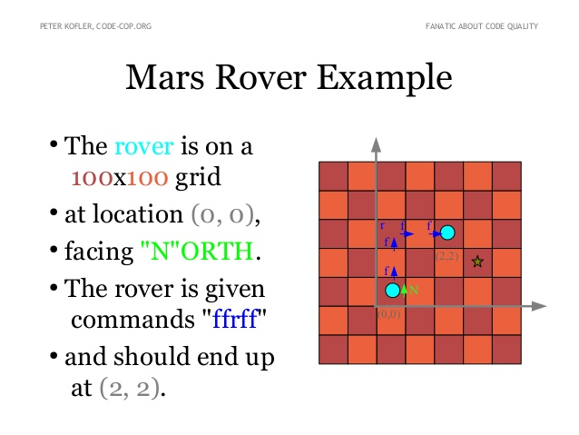

# Your Task

You’re part of the team that explores Mars by sending remotely controlled vehicles to the surface of the planet. Develop an API that translates the commands sent from earth to instructions that are understood by the rover.

# Input and output

* The rover receives a character array of commands. Example: "FRFLF".
    * 'F' means forward
    * 'R' means rotate right 90 degrees
    * 'L' means rotate left 90 degrees

# Requirements

* You are given the initial starting point (x,y) of a rover and the direction (N,S,E,W) it is facing.
* Implement wrapping from one edge of the grid to another. (planets are spheres after all)
* Implement obstacle detection before each move to a new square. If a given sequence of commands encounters an obstacle, the rover moves up to the last possible point, aborts the sequence and reports the obstacle.

# Rules

* Hardcore TDD. No Excuses!
* Change roles (driver, navigator) after each TDD cycle.
* No red phases while refactoring.
* Be careful about edge cases and exceptions. We cannot afford to lose a mars rover, just because the developers overlooked a null pointer.

Source: https://kata-log.rocks/mars-rover-kata

